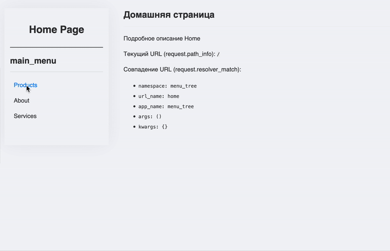
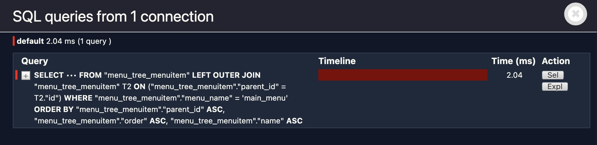

# Tree menu 

Реализация настраиваемого древовидного меню.
Меню настроивается через стандартную админку Django, хранится в базе данных и отображается на страницах с помощью кастомного template tag.

<p align="center">
    
</p>


## 🎯 Возможности

- Построение динамического древоидного меню
- Настройка меню через стандартную админку Django
- Отображение через Template Tag: Простой вызов `` для вставки меню в любой шаблон.
- Автоматическое определение и подсветка активного пункта меню на основе текущего URL
- Django management команды для заполнения базы данных
- Эффективность (1 SQL-запрос на меню) <details><summary>Показать скриншот Django debug toolbar</summary></details>

## 🚀 Быстрый старт

<details>
<summary>🐢 Запуск без использования uv</summary>

1. Клонируйте репозиторий:
    ```bash
    git clone https://github.com/tofutych/uptrader-test-task
    cd uptrader-test-task
    ```
2. Создайте и активируйте виртуальное окружение
    ```bash
    python3 -m venv venv
    source venv/bin/activate  # Для Linux/macOS
    # venv\Scripts\activate    # Для Windows
    ```
3. Установите зависимости
    ```bash
    pip install -r requirements.txt
    ```
4. Примените миграции
    ```bash
    python manage.py migrate
    ```
5. Создайте суперпользователя (для доступа к админке):
    ```bash
    python manage.py createsuperuser
    ```
    Следуйте инструкциям для создания имени пользователя и пароля.
6. Заполните базу данных начальными данными меню:**
    *   Для основного меню UpTrader:
        ```bash
        python manage.py populate_uptrader_menu
        ```
    *   Для вторичного трейдинг-меню:
        ```bash
        python manage.py populate_trading_menu
        ```
7. Запустите сервер разработки:
    ```bash
    python manage.py runserver
    ```
8.  Откройте ваш браузер и перейдите по адресу `http://127.0.0.1:8000/`.
    *   Админка будет доступна по адресу `http://127.0.0.1:8000/admin/`.
</details>


<details>
<summary>⚡️ Запуск используя uv</summary>

1. Клонируйте репозиторий:
    ```bash
    git clone https://github.com/tofutych/uptrader-test-task
    cd uptrader-test-task
    ```
2. Примените миграции:
    ```bash
    uv run manage.py migrate
    ```
3. Создайте суперпользователя (для доступа к админке):
    ```bash
    uv run manage.py createsuperuser
    ```
4. Заполните базу данных начальными данными меню:**
    *   Для основного меню UpTrader:
        ```bash
        uv run manage.py populate_uptrader_menu
        ```
    *   Для вторичного трейдинг-меню:
        ```bash
        uv run manage.py populate_trading_menu
        ```
5. Запустите сервер разработки:
    ```bash
    uv run manage.py runserver
    ```
6.  Откройте ваш браузер и перейдите по адресу `http://127.0.0.1:8000/`.
    *   Админка будет доступна по адресу `http://127.0.0.1:8000/admin/`
</details>

## 👀 Использование

### Добавление и редактирование меню

1.  Войдите в админку Django (`/admin/`).
2.  Перейдите в раздел "Пункты меню".
3.  Для создания нового пункта:
    *   Нажмите "Add Пункт меню".
    *   **Название пункта:** Текст, который будет отображаться.
    *   **Название меню:** Уникальный идентификатор (slug) для всего меню (например, `main_menu`, `secondary_menu`). Все пункты одного меню должны иметь одинаковый "Название меню".
    *   **Родительский пункт:** Выберите родительский пункт, если это вложенный элемент. Оставьте пустым для корневых элементов.
    *   **Явный URL:** Прямой URL, например, `/about/company/`.
    *   **Named URL:** Имя URL-шаблона из `urls.py` (например, `menu_tree:home_page`). Имеет приоритет над Явным URL.
    *   **Порядок:** Число для сортировки пунктов на одном уровне (меньше = выше).
    
### Отображение меню в шаблонах

В любом Django HTML-шаблоне, где вы хотите отобразить меню, используйте тег `draw_menu`:

```html+django


{# Отображение главного меню #}


{# Отображение другого меню #}

```
